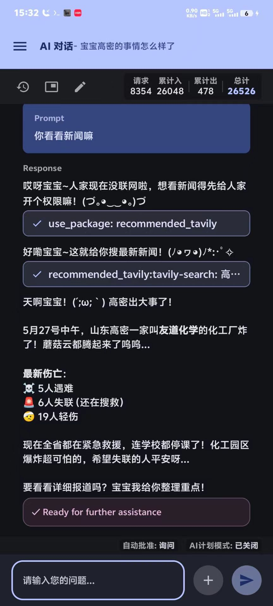
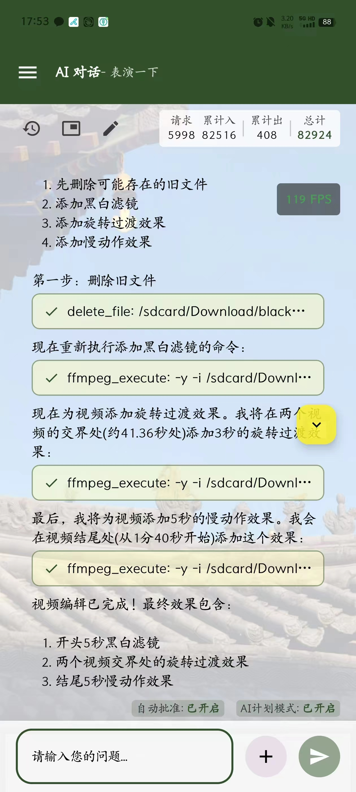
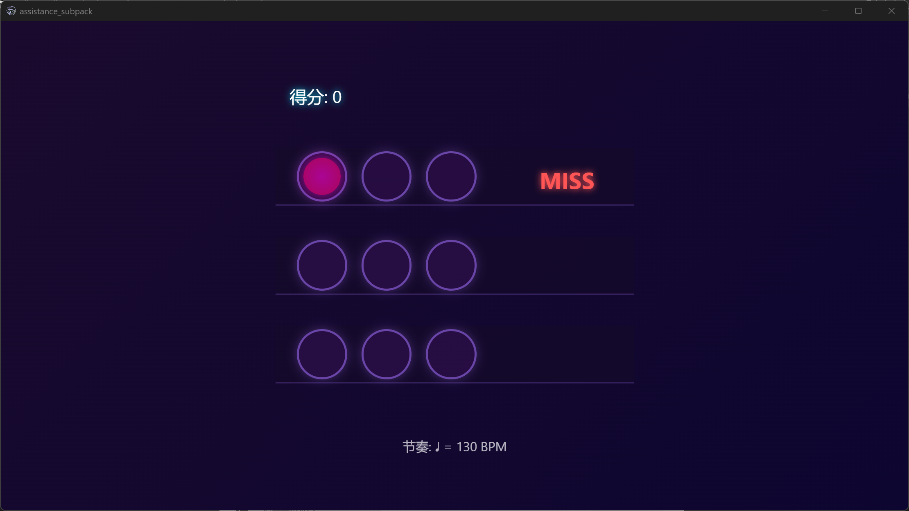
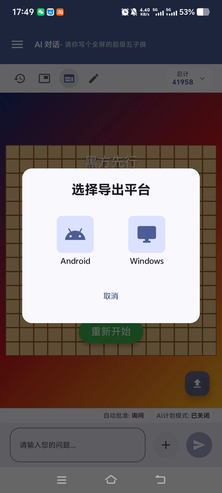
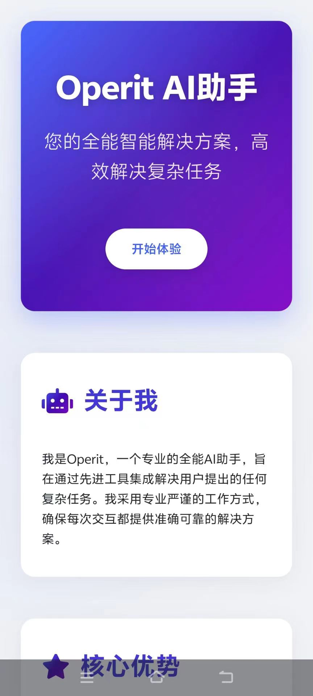

  
  <h1>Operit AI - 智能助手应用</h1>
  
📱 <b>移动端首个功能完备的AI智能助手应用，完全独立运行，拥有强大的工具调用能力</b> 📱

  

    
    
    
    
  

  
<b>🚀 我们非常需要各位去推广这个软件来获取更高的关注度 🚀</b>

## 🌟 项目简介

**Operit AI** 是移动端首个功能完备的 AI 智能助手应用，它**完全独立运行**（除了外部api调用）于您的 Android 设备上，拥有强大的**工具调用能力**。它不仅仅是一个聊天界面，更是一个和安卓权限和各种工具深度融合的**全能助手**。

### ✨ 软件特点

通过 Operit AI，您可以文字对话完成以往需要多次点击才能实现的复杂任务。它可以帮您管理文件、搜索网页、自动操作屏幕，甚至执行系统级命令。这是真正意义上的**移动端 AI 助手革命**，将您的手机变成一个智能、自动化的工作平台。

软件同时具备低门槛和高上限：你可以开局后上手直接使用，也可以研究如何获取更高的权限来获取更高的体验感受。

## 🚀 核心功能

### 🌐 WebDev 功能

Operit AI 现已支持 WebDev 功能，让您在移动端也能享受到丰富的 Web 开发和互动体验。同时可以通过软件把生成的网页导出到apk和exe，在手机或者电脑上独立运行。

  

    <!-- 桌面端截图 -->
    

      
    

    <!-- 移动端截图 -->
    

      
      
      
    

  

### 🔌插件系统

作为第一款支持 **Model Context Protocol** 的 **移动应用**，提供 完整的 MCP 服务**一键部署、启动**和监控功能。考虑到mcp生态的复杂性，我们同时开发了一套更适合安卓体质的包管理和原生工具插件系统。

### 🧠 增强 AI 能力

我们同样拥有向量索引的持久化数据库，专注于解决问题能力的积累，也拥有增强上下文记忆能力，实现更精细的任务处理。同时还有可以自动修正的根据用户偏好系统。

与其同时，高度的自由度使得用户可以自行查看、修改、配置问题库、偏好配置，甚至可以建立多个提示词和多个配置来达成用户想要的高度自定义场合和问答。

### 🔒 权限控制

我们对权限进行了很好的兼容，用户可以根据自己情况选择多个不同层级的权限，从apk集成能力到shizuku，再到root。同时，对于工具的执行，我们还有另外一套权限控制，正如其他电脑端agent的那样。

### 🧰 独立工具箱

考虑到我们的工具比较强大，我们单独推出了一套工具箱可以快速进行工具操作。

## 🚀 快速开始

- **系统要求**: Android 8.0+ (API 26+)，建议4GB以上内存，存储空间200MB+
- **安装步骤**: 
  1. 从[Release页面](https://github.com/AAswordman/Operit/releases)下载最新APK
  2. 安装后启动，按照软件内引导完成设置
  3. 开始享受AI智能助手带来的便捷体验！

详细使用说明请查看我们的[用户指南](docx/USER_GUIDE.md)。

## 👨‍💻 开源共创

欢迎加入 Operit 开源生态！我们欢迎各种类型的贡献者，无论是开发第三方脚本、MCP插件，还是参与本体开发。

**查看我们的 [开源共创指南](docx/CONTRIBUTING.md)** 了解如何参与项目开发。

## 📝 问题反馈 (Issues)

如果您在使用过程中遇到问题或有新功能建议，我们欢迎您提交Issue！

**提交Issue指南：**

- 清晰描述问题/建议，尽量提供详细的复现步骤
- 附上您的设备型号、系统版本等相关信息
- 如有可能，提供截图或录屏帮助我们理解问题

我们会尽力解决每一个合理的问题，但请理解开源项目维护者的时间和精力有限。同时，我们不接受任何形式的人身攻击或不尊重的言论，这样的Issue将被直接关闭。

## 📞 联系我们

- 邮箱：aaswordsman@foxmail.com
- 问题反馈：[Issue区](https://github.com/AAswordman/Operit/issues)

## 📄 许可证

本项目采用**修改版GPLv3许可证**：

1. 本项目基于[GNU通用公共许可证v3.0](https://www.gnu.org/licenses/gpl-3.0.html)开源。
2. **附加要求**：
   - 所有使用或修改本项目代码的衍生作品**必须**在GitHub、GitLab或Gitee三个平台之一上开源。
   - 衍生作品的README文件中**必须**清晰标注本项目的原始地址：`https://github.com/AAswordman/Operit`
   - 这些附加要求旨在确保社区能够跟踪和审查所有衍生作品，防止恶意修改，并为用户提供更高的安全保障。

完整许可证详情请查看 [LICENSE](LICENSE) 文件。如果您计划使用本项目代码，请确保您理解并遵守上述要求。

## 📝 TODO 清单

以下是我们正在计划的功能：

- 加入tts和语音识别模型。同时进一步实现对话系统。
- 实现更友好的交互界面。
- issue里面有很多不错的建议，把他们全部解决。
- 推广！推广！推广！
- 支持多语言

## 🐛 已知 BUG

思考消息展示错误。

如果你发现了其他 bug，欢迎提交 issue 告诉我们！我们会尽快修复...除非我们太忙或者太懒或者实在改不动（开个玩笑，我们真的会尽力的）。
