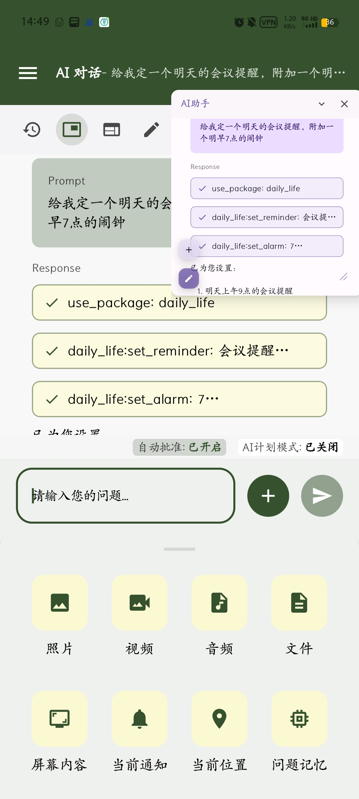
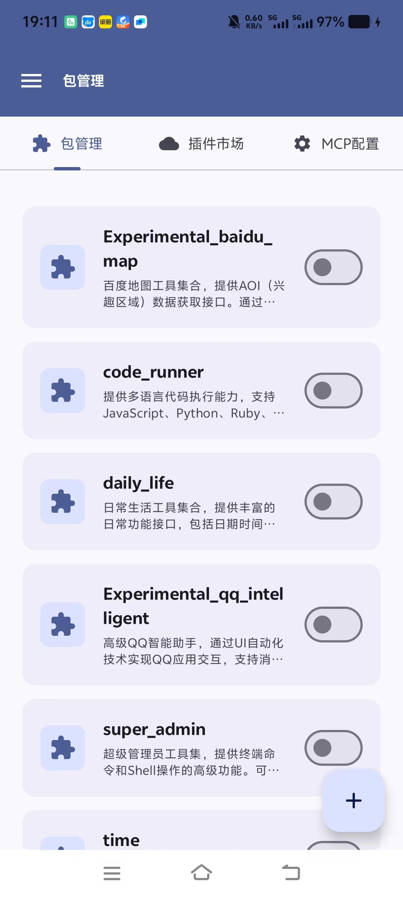
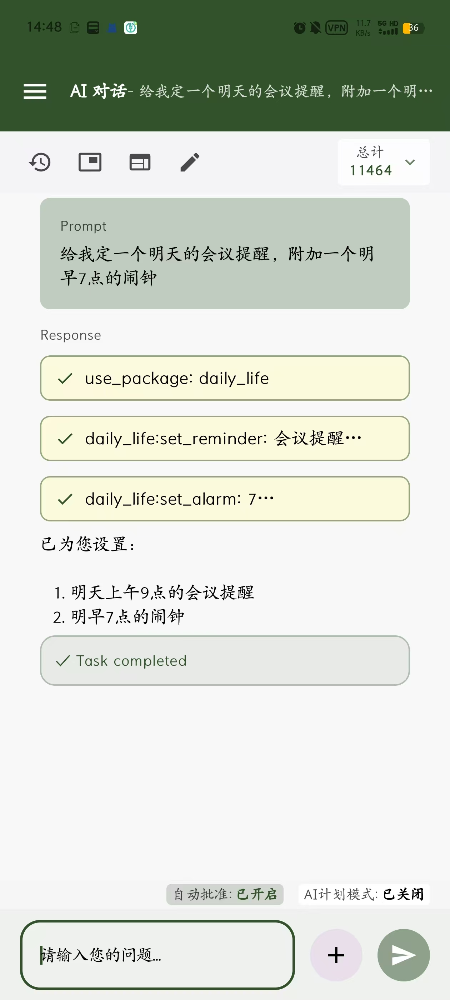

  中文 | <a href="README(E).md">English</a>

  
  
  
   
  
  
  

  
  <h1>Operit AI - 智能助手应用</h1>
  
📱 <b>移动端首个功能完备的AI智能助手应用，完全独立运行，拥有强大的工具调用能力</b> 📱

  

    
    
    
    
  

  
<b>🚀 我们非常需要各位去推广这个软件来获取更高的关注度 🚀</b>

## 🌟 项目简介

**Operit AI** 是移动端首个功能完备的 AI 智能助手应用，它**完全独立运行**（除了外部api调用）于您的 Android 设备上，拥有强大的**工具调用能力**。它不仅仅是一个聊天界面，更是一个和安卓权限和各种工具深度融合的**全能助手**。

## 🛠️ 丰富的内置工具

Operit内置超过40种强大工具，支持AI助手与您的设备深度交互：

- **文件系统工具**：读写文件、搜索文件、解压缩、文件转换等
- **HTTP工具**：网络请求、网页访问、文件上传下载等
- **系统操作工具**：管理系统设置、安装应用、控制应用运行等
- **UI自动化工具**：屏幕点击、滑动、元素查找、表单填写等
- **媒体处理工具**：视频转换、编解码、帧提取等

这些内置工具结合丰富的插件系统，让Operit可以完成从简单到复杂的各类任务，真正实现手机智能助手的全能体验。

## 🚀 核心功能展示

### 🎮 游戏制作功能

Operit AI 让您直接在手机上创建和玩游戏，从构思到实现一气呵成。

  

    
    
    
  

  
👆 只需描述您的游戏创意，AI就能帮您设计、实现并打包成可分享的游戏

### 🌐 Web开发功能

在手机上设计网页并导出为独立应用，既可用于个人展示页面，也可以创建实用工具。

  

    <!-- 桌面端截图 -->
    
    <!-- 移动端截图 -->
    

      
      
    

  

  
👆 网页应用开发，支持导出为独立应用和多种交互体验

### 📱 悬浮窗与附件功能

Operit AI 支持悬浮窗模式和便捷的附件上传，随时调用AI功能和共享各类文件。

  

    
  

  
👆 悬浮窗随时调用，附件功能便捷共享

### 🔌 强大的插件系统

Operit AI 提供丰富的插件生态，配合内置工具可实现从日常生活工具到代码运行、地图查询、系统管理等多种功能。通过自然语言一句话，即可完成以往需要多步操作的复杂任务。

  

    
    
  

  
👆 丰富的插件生态系统和内置工具，各种功能一触即发

## 🚀 快速开始

> **详细的安装指南和丰富的使用示例，请查阅我们的 👉 [用户指南](docx/USER_GUIDE.md)**

- **系统要求**: Android 8.0+ (API 26+)，建议4GB以上内存，存储空间200MB+
- **安装步骤**: 
  1. 从[Release页面](https://github.com/AAswordman/Operit/releases)下载最新APK
  2. 安装后启动，按照软件内引导完成设置
  3. 开始享受AI智能助手带来的便捷体验！

## 👨‍💻 开源共创

欢迎加入 Operit 开源生态！我们欢迎各种类型的贡献者，无论是开发第三方脚本、MCP插件，还是参与本体开发。

对于本仓库，你必须从`https://drive.google.com/drive/folders/1g-Q_i7cf6Ua4KX9ZM6V282EEZvTVVfF7?usp=sharing`下载一些依赖库，并放入有.keep的文件夹

**Live2D SDK说明：**
- 由于许可限制，我们不提供Live2D SDK，您需要自行下载并放入`/SDKRoot`目录
- 下载地址：[Live2D Cubism Native Samples](https://github.com/Live2D/CubismNativeSamples) 或 [Live2D官网SDK页面](https://www.live2d.com/zh-CHS/sdk/about/#native)
- 使用时请遵守Live2D官方要求，包括但不限于保留logo以及"Powered By Live2D"声明

**查看我们的 [开源共创指南](docx/CONTRIBUTING.md)** 了解如何参与项目开发。

## 💖 贡献者

感谢所有为 Operit AI 做出贡献的人！

## 📝 问题反馈 (Issues)

如果您在使用过程中遇到问题或有新功能建议，我们欢迎您提交Issue！

**提交Issue指南：**

- 清晰描述问题/建议，尽量提供详细的复现步骤
- 附上您的设备型号、系统版本等相关信息
- 如有可能，提供截图或录屏帮助我们理解问题

我们会尽力解决每一个合理的问题，但请理解开源项目维护者的时间和精力有限。同时，我们不接受任何形式的人身攻击或不尊重的言论，这样的Issue将被直接关闭。

## 📞 联系我们

- 邮箱：aaswordsman@foxmail.com
- 问题反馈：[Issue区](https://github.com/AAswordman/Operit/issues)

## 📄 许可证

本项目采用**修改版GPLv3许可证**：

1. 本项目基于[GNU通用公共许可证v3.0](https://www.gnu.org/licenses/gpl-3.0.html)开源。
2. **附加要求**：
   - 所有使用或修改本项目代码的衍生作品**必须**在GitHub、GitLab或Gitee三个平台之一上开源。
   - 衍生作品的README文件中**必须**清晰标注本项目的原始地址：`https://github.com/AAswordman/Operit`
   - 这些附加要求旨在确保社区能够跟踪和审查所有衍生作品，防止恶意修改，并为用户提供更高的安全保障。

完整许可证详情请查看 [LICENSE](LICENSE) 文件。如果您计划使用本项目代码，请确保您理解并遵守上述要求。

## 📝 TODO 清单

以下是我们正在计划的功能：

- 加入tts和语音识别模型。同时进一步实现对话系统。
- 实现更友好的交互界面。
- issue里面有很多不错的建议，把他们全部解决。
- 推广！推广！推广！
- 支持多语言

## 🐛 已知 BUG

请访问 [Issue区](https://github.com/AAswordman/Operit/issues) 查看最新的已知问题列表。

如果你发现了其他 bug，欢迎提交 issue 告诉我们！我们会尽快修复。
