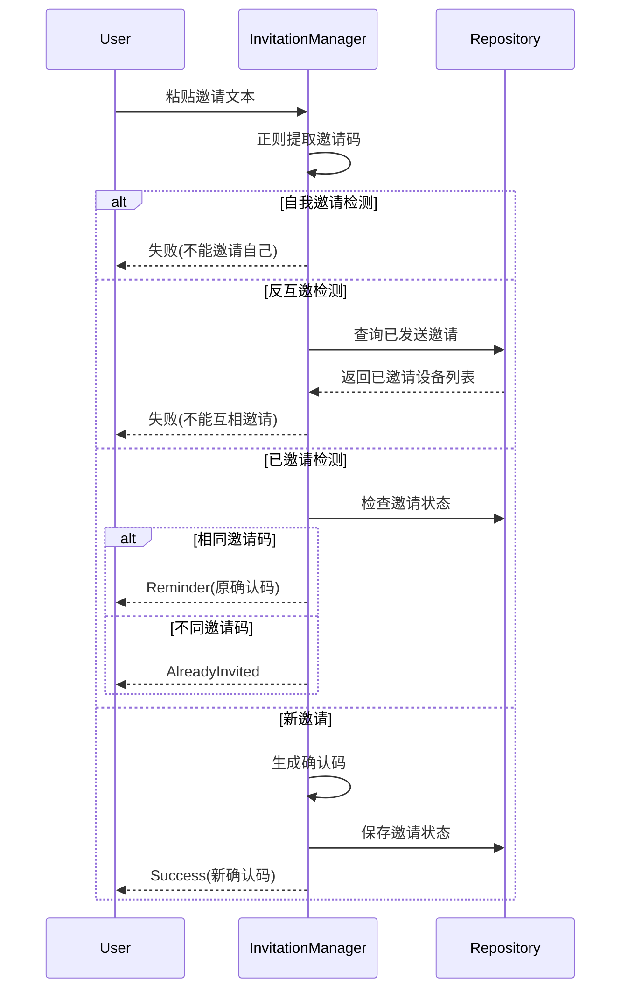

# 邀请管理模块（InvitationManager）

# Operit 邀请管理模块分析

## 核心功能概述
该模块实现了完整的邀请流程管理：
- **邀请码生成**：基于设备ID生成唯一邀请码
- **邀请消息生成**：创建包含邀请码的宣传文案
- **邀请处理**：解析剪贴板中的邀请码并验证
- **防滥用机制**：防止自我邀请、互相邀请等滥用行为
- **确认码生成与验证**：生成加密确认码并验证其有效性

## 技术架构图


## 邀请流程状态管理

```
sealed class ProcessInvitationResult {
    data class Success(val message: String, val confirmationCode: String)
    data class Failure(val reason: String)
    object AlreadyInvited
    data class Reminder(val confirmationCode: String)
}

```

- 设计模式:密封类(Sealed Class)实现状态机
- 状态类型:
  - `Success`:邀请成功
  - `Failure`:邀请失败(含原因)
  - `AlreadyInvited`:设备已经被邀请
  - `Reminder`:重复邀请提醒

3.安全机制实现

## 设备ID获取

```
@SuppressLint("HardwareIds")
private fun getDeviceID(): String {
    return Settings.Secure.getString(context.contentResolver, Settings.Secure.ANDROID_ID)
}
```

- 使用Android系统级ID(ANDROID_ID)
- 添加`@SuppressLint("HardwareIds")`绕过lint警告

## 加密确认码生成

```
fun generateConfirmationCode(invitationCodeFromA: String): String? {
    val deviceIdB = getDeviceID()
    val hmac = generateHmac(secret = invitationCodeFromA, message = deviceIdB)
    return "$deviceIdB:$hmac"
}

```

- 格式:设备ID:HMAC签名
- 使用邀请码作为HMAC密钥

## HMAC验证

```
private fun generateHmac(secret: String, message: String): String? {
    val secretKey = SecretKeySpec(secret.toByteArray(), "HmacSHA256")
    val mac = Mac.getInstance("HmacSHA256")
    mac.init(secretKey)
    val hmacBytes = mac.doFinal(message.toByteArray())
    return Base64.encodeToString(hmacBytes, Base64.NO_WRAP)
}
```

- 算法:HMAC-SHA256
- 编码:Base64

## 数据存储设计

通过 `InvitationRepository` 实现数据持久化:

```
class InvitationRepository(private val context: Context) {
    // 使用SharedPreferences存储
    private val prefs = context.getSharedPreferences("invitation_prefs", Context.MODE_PRIVATE)
    
    // 关键数据项
    val isInvitedFlow: Flow<Boolean>
    val lastUsedInvitationCodeFlow: Flow<String>
    val sentInvitationToDeviceIdsFlow: Flow<Set<String>>
    val invitationCountFlow: Flow<Int>
    
    // 操作方法
    fun setDeviceAsInvited()
    fun setLastUsedInvitationCode(code: String)
    fun incrementInvitationCount()
    fun addSentInvitation(deviceIdHash: String)
}

```
