# Operit AI User Guide

  <a href="./USER_GUIDE.md">简体中文</a> | <strong>English</strong>

  

  <strong>From here, you will witness the creativity of countless users.</strong> 
  <strong>From here, you will showcase your creativity!</strong>

---

<h2 id="table-of-contents">📖 Table of Contents</h2>

- [✨ Introduction](#introduction)
- [🗺️ Basic Walkthrough](#basic-walkthrough)
  - [First Use/Trial](#first-use)
  - [How to Package a Web App Created by AI](#package-web-app)
  - [How to Configure Your Own API/Other Models](#api-configuration)
    - [Configure Your Own DeepSeek API](#deepseek-api)
    - [Switch to Other AI Models](#switch-models)
  - [Shizuku Authorization Flow](#shizuku-authorization)
  - [Package Management and MCP Usage](#package-management)
    - [Enabling Packages](#enabling-packages)
    - [One-Click Environment Configuration](#environment-configuration)
    - [MCP Configuration Flow](#mcp-configuration)
- [🚀 Advanced Usage in Practice](#advanced-usage)
  - [🧰 Out-of-the-Box](#out-of-the-box)
  - [📦 Extension Packages](#extension-packages)
  - [🛠️ Core Tools](#core-tools)
  - [🛒 MCP Market](#mcp-market)
    - [How MCPs Work](#mcp-work-mechanism)
    - [MCP Download and Deployment](#mcp-deployment)
    - [MCP Common Issues](#mcp-config-issues)
- [❔ FAQ](#faq)
  - [MCP Troubleshooting](#mcp-troubleshooting)
- [🎉 Join Us](#join-us)
- [💡 Wishlist](#wishlist)
- [📜 Reminiscence (Older Version FAQ)](#reminiscence)

---

<h2 id="introduction" style="display: flex; justify-content: space-between; align-items: center;">✨ Introduction<a href="#table-of-contents" style="text-decoration: none; font-size: 0.8em;" title="Back to Top">🔝</a></h2>

Welcome to **Operit AI**! This guide is designed to help you get started quickly and make the most of Operit AI's powerful features, turning your phone into a true smart assistant.

>*This document was last updated: 2025/6/17*

<h2 id="basic-walkthrough" style="display: flex; justify-content: space-between; align-items: center;">🗺️ Basic Walkthrough<a href="#table-of-contents" style="text-decoration: none; font-size: 0.8em;" title="Back to Top">🔝</a></h2>

<h3 id="first-use" style="display: flex; justify-content: space-between; align-items: center;">First Use/Trial<a href="#basic-walkthrough" style="text-decoration: none; font-size: 0.8em;" title="Back to Parent">↩️</a></h3>

When using Operit AI for the first time, you'll need to perform a simple setup to grant the necessary permissions to unlock its full functionality. Here are the detailed steps:
 >Demonstration version `1.1.5`. Later versions will have a 'Skip' button in the top right corner.

<table style="width: 100%;">
  <thead>
    <tr>
      <th style="width: 25%; text-align: left;">Step</th>
      <th style="width: 45%; text-align: left;">Explanation & Action</th>
      <th style="width: 30%; text-align: left;">Screenshot</th>
    </tr>
  </thead>
  <tbody>
    <tr id="step-1">
      <td style="vertical-align: top;"><strong>Step 1: Read Our Agreement</strong></td>
      <td style="vertical-align: top; padding-right: 15px;">
        <em>We declare that data flows only between your local device and the API platform you provide. We do not have any servers.</em>
      </td>
      <td style="vertical-align: top;">
        
      </td>
    </tr>
    <tr id="step-2">
      <td style="vertical-align: top;"><strong>Step 2: Find and Enable Operit AI in System Settings</strong></td>
      <td style="vertical-align: top; padding-right: 15px;">
        You can go directly to the relevant settings page, or you may need to find Operit AI in the "Installed apps" list and tap to enter. 
        <em>Find "Operit AI" in the settings list and tap it to proceed with the configuration.</em>
        <blockquote>Versions after <code>1.1.6</code> can skip the guide.</blockquote>
        <blockquote>If you are stuck here and cannot grant certain permissions, please exit the app and turn off the screen before retrying to skip the guide, as this guide only appears on the first launch.</blockquote>
      </td>
      <td style="vertical-align: top;">
        
      </td>
    </tr>
    <tr id="step-3">
      <td style="vertical-align: top;"><strong>Step 3: Set User Preferences</strong></td>
      <td style="vertical-align: top; padding-right: 15px;">
        On your first time, we will recommend you to go to the settings. This will determine how the AI perceives you.
        <blockquote>You can change this later in <code>Settings > User Preferences</code>. Customization is supported.</blockquote>
        <em>Turn on the "Use Operit AI" switch and tap "Allow" in the system pop-up window. This is a security warning; Operit AI will use this permission responsibly.</em>
      </td>
      <td style="vertical-align: top;">
        <a href="assets/user_step/step_for_frist_3.jpg" target="_blank" rel="noopener noreferrer">
          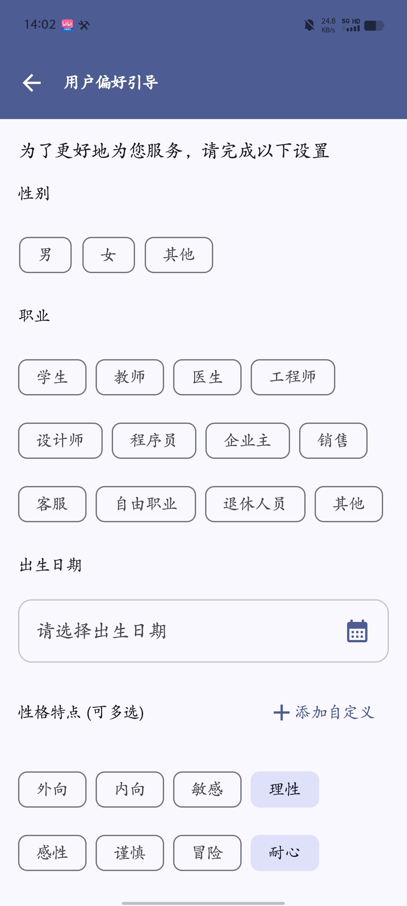
        </a>
      </td>
    </tr>
    <tr id="step-4">
      <td style="vertical-align: top;"><strong>Step 4: Configure Your API</strong></td>
      <td style="vertical-align: top; padding-right: 15px;">
        After configuration, you can return to Operit AI and start your journey with your smart assistant! Of course, you can also use the author's default API to get a full experience once (per day). 
        <em>Configure the API and start using it.</em>
        <blockquote>The AI's API and model can be changed in <code>Settings > AI Model Configuration > Model & Parameters / Functional Model Configuration</code>.</blockquote>
        <blockquote>The model prompt can be changed in <code>Settings > Personalization > Model Prompt Settings</code>, where some model parameter settings are also located.</blockquote>
      </td>
      <td style="vertical-align: top;">
        
      </td>
    </tr>
  </tbody>
</table>

<h3 id="package-web-app" style="display: flex; justify-content: space-between; align-items: center;">How to Package a Web App Created by AI<a href="#basic-walkthrough" style="text-decoration: none; font-size: 0.8em;" title="Back to Parent">↩️</a></h3>
<em>The following steps demonstrate how to package a web application developed by the AI. (Click images to enlarge)</em>
 
<table style="width: 100%;">
  <tbody>
    <tr>
      <td style="text-align: center; padding: 8px; width: 50%;">Step 1: Go to the Packaging Page</td>
      <td style="text-align: center; padding: 8px; width: 50%;">Step 2: Start Packaging</td>
    </tr>
    <tr>
      <td style="text-align: center; padding: 8px; vertical-align: top;">
        <a href="assets/teach_step/1-1.png" target="_blank" rel="noopener noreferrer">
          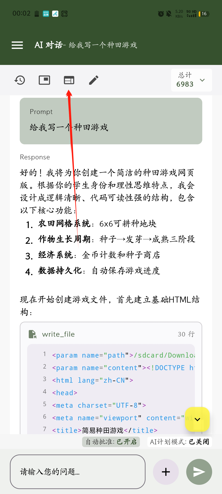
        </a>
      </td>
      <td style="text-align: center; padding: 8px; vertical-align: top;">
        <a href="assets/teach_step/1-2.png" target="_blank" rel="noopener noreferrer">
          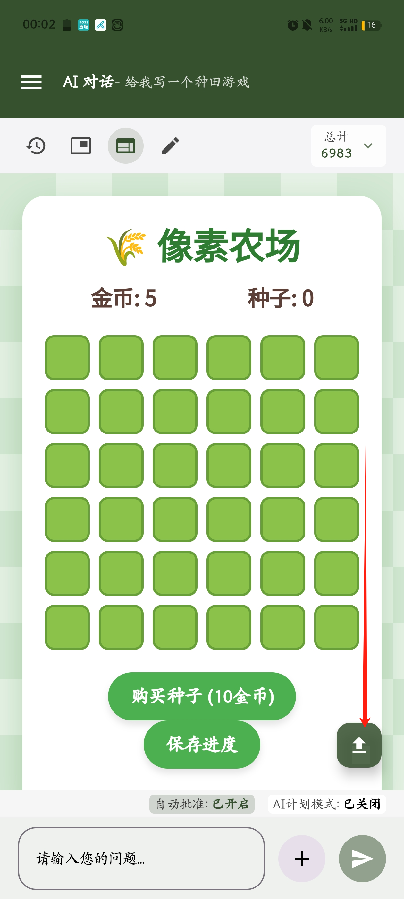
        </a>
      </td>
    </tr>
    <tr>
      <td style="text-align: center; padding: 8px;">Step 3: Set Application Information</td>
      <td style="text-align: center; padding: 8px;">Step 4: Download or Share</td>
    </tr>
    <tr>
      <td style="text-align: center; padding: 8px; vertical-align: top;">
        <a href="assets/teach_step/1-3.jpg" target="_blank" rel="noopener noreferrer">
          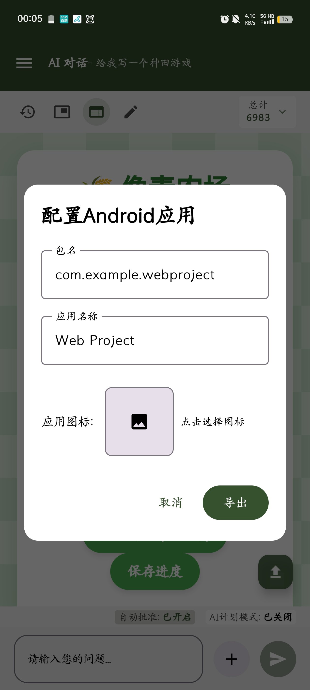
        </a>
      </td>
      <td style="text-align: center; padding: 8px; vertical-align: top;">
        <a href="assets/teach_step/1-4.jpg" target="_blank" rel="noopener noreferrer">
         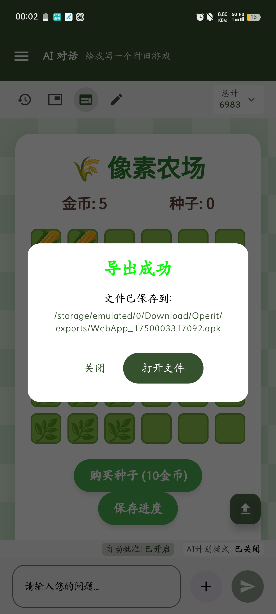
        </a>
      </td>
    </tr>
  </tbody>
</table>
 

<h3 id="api-configuration" style="display: flex; justify-content: space-between; align-items: center;">How to Configure Your Own API/Other Models<a href="#basic-walkthrough" style="text-decoration: none; font-size: 0.8em;" title="Back to Parent">↩️</a></h3>

<h4 id="deepseek-api" style="display: flex; justify-content: space-between; align-items: center;">Configure Your Own DeepSeek API<a href="#api-configuration" style="text-decoration: none; font-size: 0.8em;" title="Back to Parent">⤴️</a></h4>
<em>Follow these steps to easily configure the DeepSeek API for use in Operit AI.</em>

If you want to configure your own API (instead of using the default one provided in the app), you can follow this process:

<table style="width: 100%;">
  <tbody>
    <tr>
      <td colspan="3" style="padding-bottom: 8px;">
        <h5>Step 1: Log in/Register on the DeepSeek Open Platform</h5>
        
First, you need to visit the DeepSeek Open Platform and log in to your account. We have embedded the DeepSeek open platform within the software. If this is your first time, you will need to register.

      </td>
    </tr>
    <tr>
      <td style="text-align: center; padding: 8px; vertical-align: top; width: 33%;"><a href="assets/deepseek_API_step/1.png" target="_blank" rel="noopener noreferrer">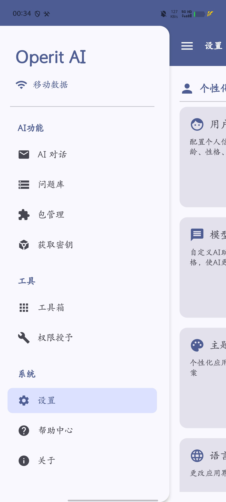</a></td>
      <td style="text-align: center; padding: 8px; vertical-align: top; width: 33%;"></td>
      <td style="text-align: center; padding: 8px; vertical-align: top; width: 33%;"><a href="assets/deepseek_API_step/3.png" target="_blank" rel="noopener noreferrer">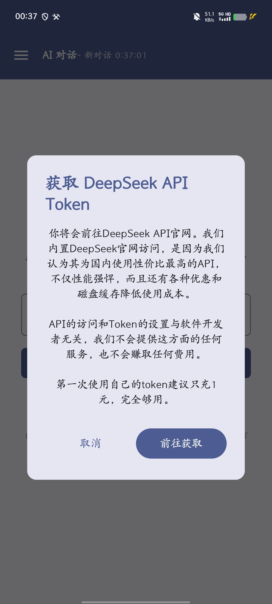</a></td>
    </tr>
    <tr>
      <td style="vertical-align: top; padding: 8px; width: 33%;">
        <h5>Step 2: Add Credits</h5>
        
API calls consume account credits. You can follow the guide in Figure 5 to top up. Even a small amount (e.g., 1 CNY) is enough for a long experience with the V3 model.

      </td>
      <td style="vertical-align: top; padding: 8px; width: 33%;">
        <h5>Step 3: Create and Copy the API Key</h5>
        
After a successful top-up, click the "Create API" button on the left. <strong>Please note: The key is only displayed in full once upon creation. Be sure to copy and store it securely immediately.</strong>

      </td>
      <td style="vertical-align: top; padding: 8px; width: 33%;">
        <h5>Step 4: Configure the Key in Operit AI</h5>
        
After creating and copying the key, return to the Operit AI application. You can directly enter your API key on the configuration page.

      </td>
    </tr>
    <tr>
      <td style="text-align: center; padding: 8px; vertical-align: top;">
        <a href="assets/deepseek_API_step/4.png" target="_blank" rel="noopener noreferrer">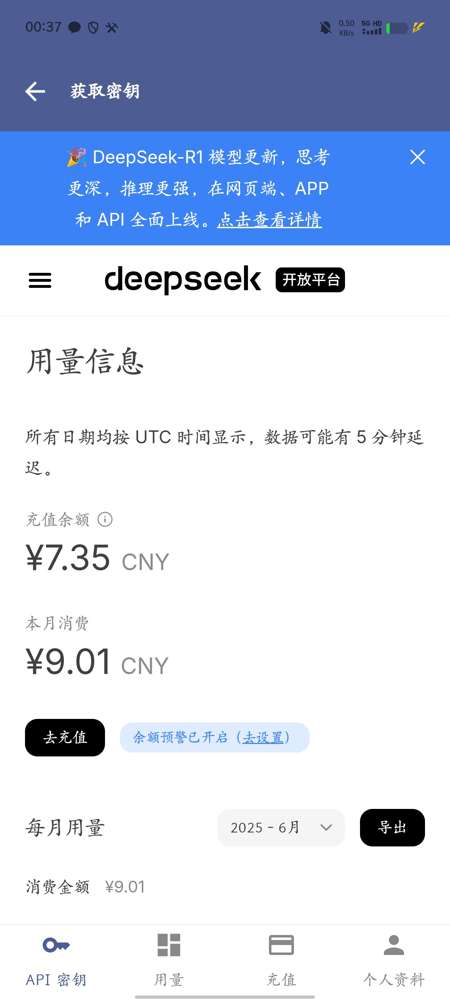</a>
      </td>
      <td style="text-align: center; padding: 8px; vertical-align: top;">
        
      </td>
      <td style="text-align: center; padding: 8px; vertical-align: top;">
        <a href="assets/deepseek_API_step/9.png" target="_blank" rel="noopener noreferrer">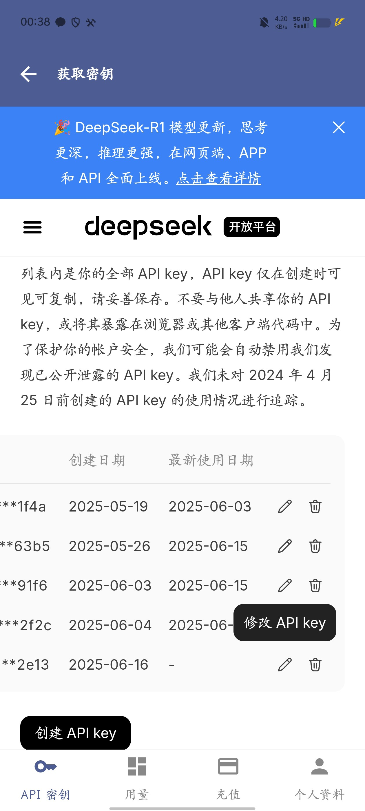</a>
      </td>
    </tr>
  </tbody>
</table>

We support most models, including Gemini. If there are newer models we don't support yet, please let us know!

<h4 id="switch-models" style="display: flex; justify-content: space-between; align-items: center;">Switch to Other AI Models<a href="#api-configuration" style="text-decoration: none; font-size: 0.8em;" title="Back to Parent">⤴️</a></h4>

You can switch and configure your desired AI model by following these steps:

<table style="width: 100%;">
  <tbody>
    <tr>
      <td style="text-align: center; padding: 8px; width: 50%;">Step 1: Go to Settings</td>
      <td style="text-align: center; padding: 8px; width: 50%;">Step 2: Select AI Model Configuration</td>
    </tr>
    <tr>
      <td style="text-align: center; padding: 8px; vertical-align: top;">
        <a href="assets/model/1.jpg" target="_blank" rel="noopener noreferrer">
          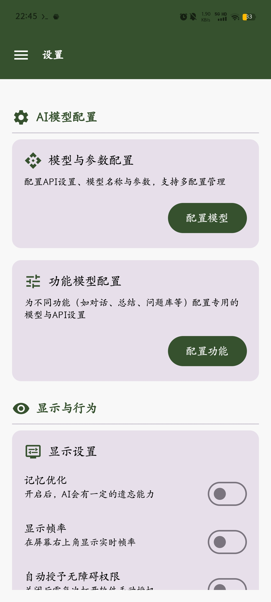
        </a>
      </td>
      <td style="text-align: center; padding: 8px; vertical-align: top;">
        <a href="assets/model/2.jpg" target="_blank" rel="noopener noreferrer">
          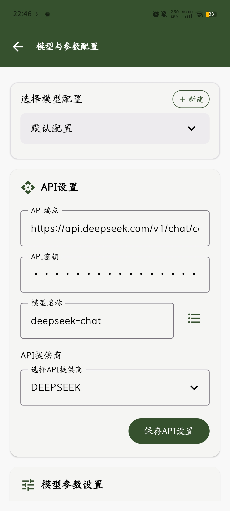
        </a>
      </td>
    </tr>
    <tr>
      <td style="text-align: center; padding: 8px;">Step 3: Model & Parameter Configuration</td>
      <td style="text-align: center; padding: 8px;">Step 4: Choose Your Model</td>
    </tr>
    <tr>
      <td style="text-align: center; padding: 8px; vertical-align: top;">
        <a href="assets/model/3.jpg" target="_blank" rel="noopener noreferrer">
          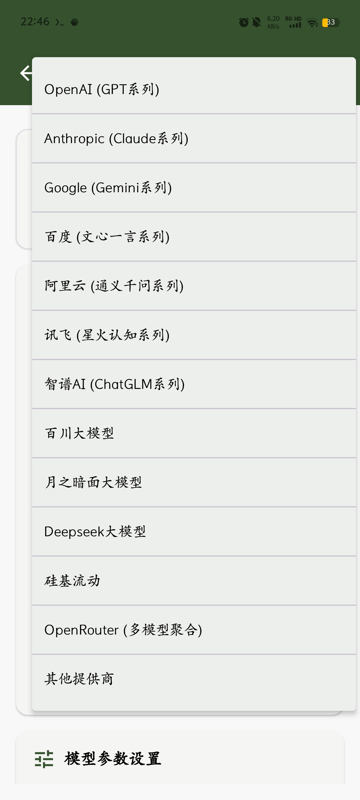
        </a>
      </td>
      <td style="text-align: center; padding: 8px; vertical-align: top;">
         <a href="assets/model/4.jpg" target="_blank" rel="noopener noreferrer">
           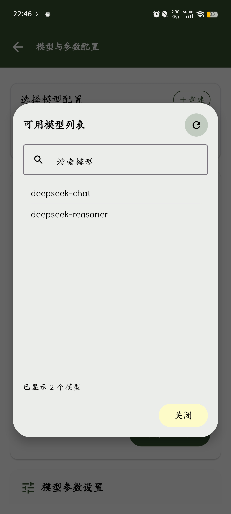
         </a>
      </td>
    </tr>
  </tbody>
</table>

<h3 id="shizuku-authorization" style="display: flex; justify-content: space-between; align-items: center;">Shizuku Authorization Flow<a href="#basic-walkthrough" style="text-decoration: none; font-size: 0.8em;" title="Back to Parent">↩️</a></h3>

After completing the Shizuku configuration, all built-in packages (except <code>coderunner</code>) can be used.

<h3 id="package-management" style="display: flex; justify-content: space-between; align-items: center;">Package Management and MCP Usage<a href="#basic-walkthrough" style="text-decoration: none; font-size: 0.8em;" title="Back to Parent">↩️</a></h3>

Built-in packages (except <code>coderunner</code>) work out of the box. Other extension packages and MCPs depend on the Termux environment. Please ensure Termux is running in the background before use.

<h4 id="enabling-packages" style="display: flex; justify-content: space-between; align-items: center;">Enabling Packages<a href="#package-management" style="text-decoration: none; font-size: 0.8em;" title="Back to Parent">⤴️</a></h4>
<table style="width: 100%; border-collapse: separate; border-spacing: 0 1em;">
    <thead>
      <tr>
       <th style="text-align: center; padding: 8px;">Step 1: Go to Package Management</th>
        <th style="text-align: center; padding: 8px;">Step 2: Enable Required Extension Packages</th>
      </tr>
     
Built-in packages (except <code>coderunner</code>) work out of the box. Other extension packages and MCPs depend on the Termux environment. Please ensure Termux is running in the background before use.

    </thead>
    <tbody>
      <tr>
       <td style="text-align: center; padding: 8px; vertical-align: top;">
          <a href="assets/package_or_MCP/1.jpg" target="_blank" rel="noopener noreferrer">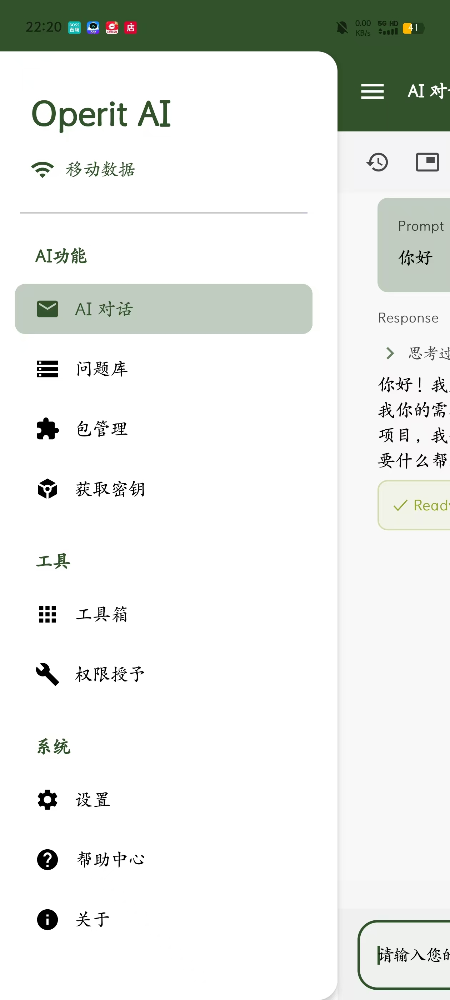</a>
       </td>
       <td style="text-align: center; padding: 8px; vertical-align: top;">
          <a href="assets/package_or_MCP/2.jpg" target="_blank" rel="noopener noreferrer">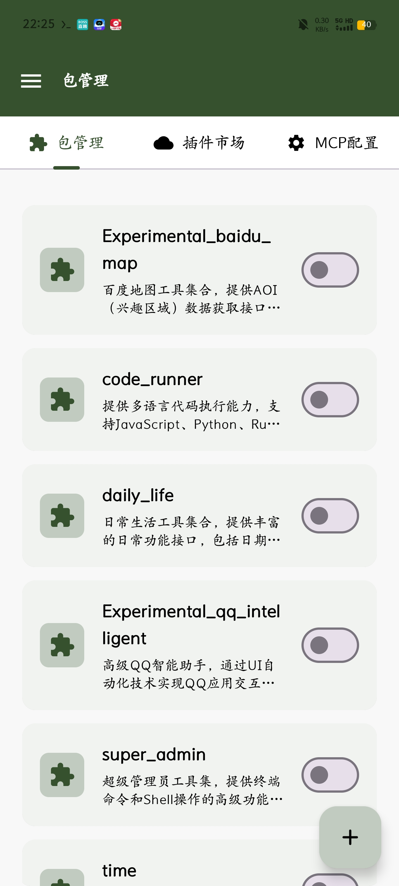</a>
       </td>
     </tr>
   </tbody>
</table>

<h4 id="environment-configuration" style="display: flex; justify-content: space-between; align-items: center;">One-Click Environment Configuration<a href="#package-management" style="text-decoration: none; font-size: 0.8em;" title="Back to Parent">⤴️</a></h4>
<table border="0" style="width:100%; border-collapse: collapse; text-align: center;">
  <tr style="vertical-align: top;">
    <td style="padding: 5px; width: 33%;">
      <strong>Step 1: Go to Toolbox</strong> 
      Find and tap the "Toolbox" entry on the main screen or in settings.
    </td>
    <td style="padding: 5px; width: 33%;">
      <strong>Step 2: Select Auto-configure Terminal</strong> 
      In the Toolbox, find and select the "Auto-configure Terminal" feature to begin the automated setup.
    </td>
    <td style="padding: 5px; width: 33%;">
      <strong>Step 3: Start Configuration</strong> 
      Click the "Start Configuration" button, and the system will automatically install and configure the required environment.
    </td>
  </tr>
  <tr>
    <td style="padding: 5px;">
      <a href="assets/package_or_MCP/3.jpg" target="_blank" rel="noopener noreferrer">
        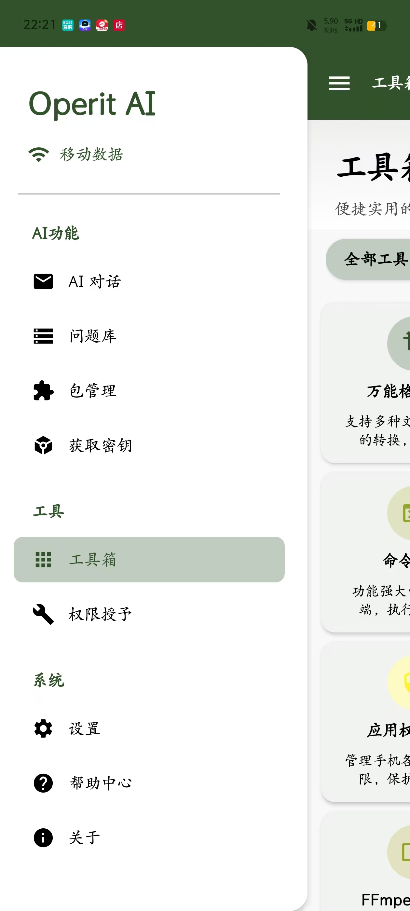
      </a>
    </td>
    <td style="padding: 5px;">
      <a href="assets/package_or_MCP/4.jpg" target="_blank" rel="noopener noreferrer">
        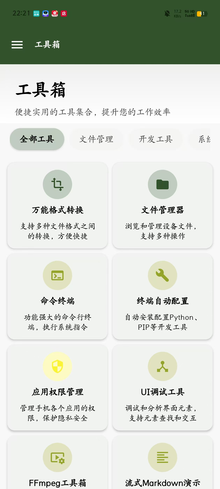
      </a>
    </td>
    <td style="padding: 5px;">
      <a href="assets/package_or_MCP/5.jpg" target="_blank" rel="noopener noreferrer">
        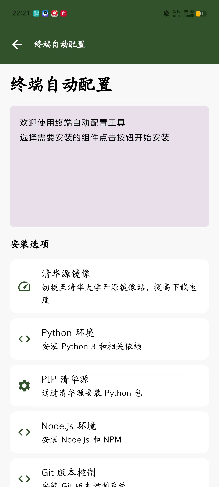
      </a>
    </td>
  </tr>
</table>

<h4 id="mcp-configuration" style="display: flex; justify-content: space-between; align-items: center;">MCP Configuration Flow<a href="#package-management" style="text-decoration: none; font-size: 0.8em;" title="Back to Parent">⤴️</a></h4>
<table style="width: 100%;">
  <tbody>
    <tr>
      <td style="text-align: center; padding: 8px; width: 50%;">Step 1: Go to MCP Market</td>
      <td style="text-align: center; padding: 8px; width: 50%;">Step 2: Click the Refresh Button</td>
    </tr>
    <tr>
      <td style="text-align: center; padding: 8px; vertical-align: top;">
        <a href="assets/package_or_MCP/7.jpg" target="_blank" rel="noopener noreferrer">
          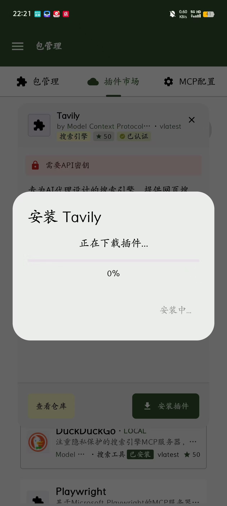
        </a>
      </td>
      <td style="text-align: center; padding: 8px; vertical-align: top;">
        
      </td>
    </tr>
    <tr>
      <td style="text-align: center; padding: 8px;">Step 3: Wait for Loading to Complete</td>
      <td style="text-align: center; padding: 8px;">Step 4: Select and Use an MCP</td>
    </tr>
    <tr>
      <td style="text-align: center; padding: 8px; vertical-align: top;">
        
      </td>
      <td style="text-align: center; padding: 8px; vertical-align: top;">
         <a href="assets/package_or_MCP/10.jpg" target="_blank" rel="noopener noreferrer">
           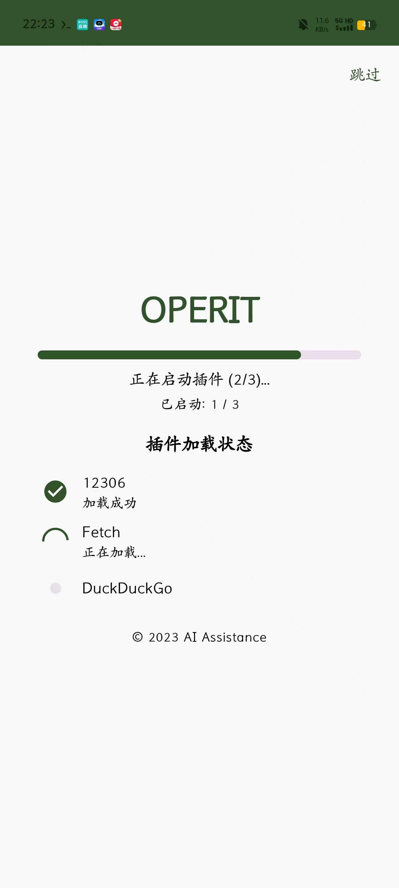
         </a>
      </td>
    </tr>
  </tbody>
</table>

<i>Want to dive deeper into how MCPs work, including deployment and troubleshooting? <a href="#mcp-market">Read more about the MCP Market</a>...</i>

<h2 id="advanced-usage" style="display: flex; justify-content: space-between; align-items: center;">🚀 Advanced Usage in Practice<a href="#table-of-contents" style="text-decoration: none; font-size: 0.8em;" title="Back to Top">🔝</a></h2>

*(This section will show you how to use advanced features like extension packages and plan mode to complete more complex tasks through practical examples.)*

<h3 id="out-of-the-box" style="display: flex; justify-content: space-between; align-items: center;">🧰 Out-of-the-Box<a href="#advanced-usage" style="text-decoration: none; font-size: 0.8em;" title="Back to Parent">↩️</a></h3>
<em>This part covers the <strong>built-in packages</strong>.</em>
 
When you ask the AI to write software, the performance of the software depends on the AI's capabilities. The model in the example is <code>Deepseel-R1</code>.

<table style="width: 100%;">
  <thead>
    <tr>
      <th style="width: 20%; text-align: left;">Example</th>
      <th style="width: 30%; text-align: left;">Description</th>
      <th style="width: 50%; text-align: left;">Preview</th>
    </tr>
  </thead>
  <tbody>
    <tr>
      <td style="vertical-align: top;"><strong>Create a 2D bullet hell game</strong></td>
      <td style="vertical-align: top;">
        Through simple conversation, let the AI design and implement a classic 2D bullet hell shooter game for you. Operit AI can use its basic coding abilities to build the complete game logic and dynamic graphics from scratch using only HTML and JavaScript.
      </td>
      <td style="vertical-align: top; text-align: center;">
        <a href="assets/game_maker_chat.jpg" target="_blank" rel="noopener noreferrer">
          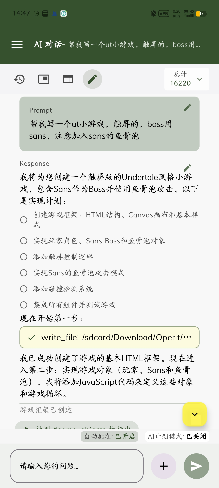
        </a>
        <a href="assets/game_maker_show.jpg" target="_blank" rel="noopener noreferrer">
          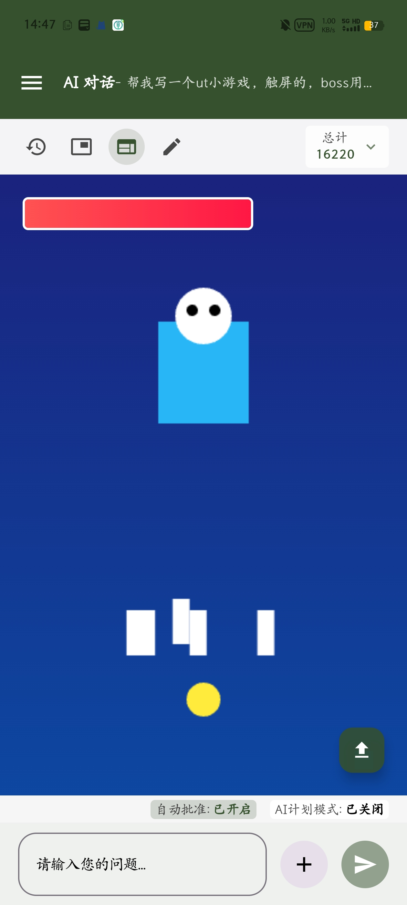
        </a>
      </td>
    </tr>
    <tr>
      <td style="vertical-align: top;"><strong>Create a 3D game with HTML</strong></td>
      <td style="vertical-align: top;">
        Without any extension packages, Operit AI can create a dynamic 3D game scene for you using only its built-in core tools with HTML and JavaScript code.
      </td>
      <td style="vertical-align: top; text-align: center;">
        <a href="assets/expamle/3ddebdde4958ac152eeca436e39c0f6.jpg" target="_blank" rel="noopener noreferrer">
          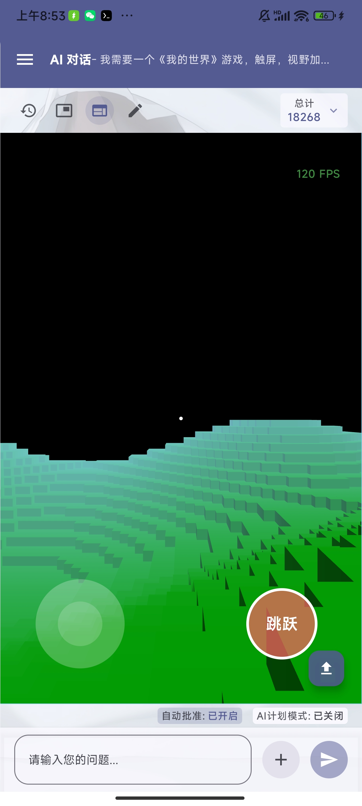
        </a>
        <a href="assets/expamle/759d86a7d74351675b32acb6464585d.jpg" target="_blank" rel="noopener noreferrer">
          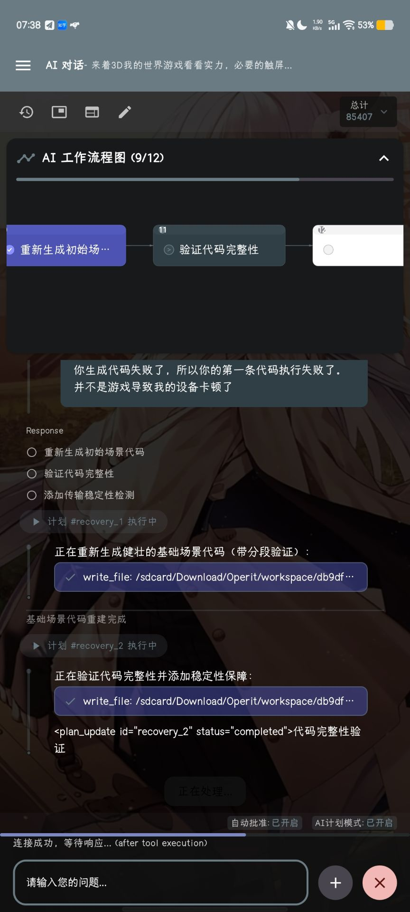
        </a>
      </td>
    </tr>
    <tr>
      <td style="vertical-align: top;"><strong>Simple video processing</strong></td>
      <td style="vertical-align: top;">
        Similarly, the application has a powerful FFmpeg tool built-in. No additional installation is required to let the AI help you with various video processing tasks such as format conversion, trimming, and merging.
      </td>
      <td style="vertical-align: top; text-align: center;">
        
      </td>
    </tr>
    <tr>
      <td style="vertical-align: top;"><strong>Software packaging and deployment</strong></td>
      <td style="vertical-align: top;">
        From writing code to final release, Operit AI can further call upon platform tools to package the completed software into executable files for Android (APK) or Windows (EXE), achieving an end-to-end automated development process.
      </td>
      <td style="vertical-align: top; text-align: center;">
        <a href="assets/web_developer.jpg" target="_blank" rel="noopener noreferrer">
          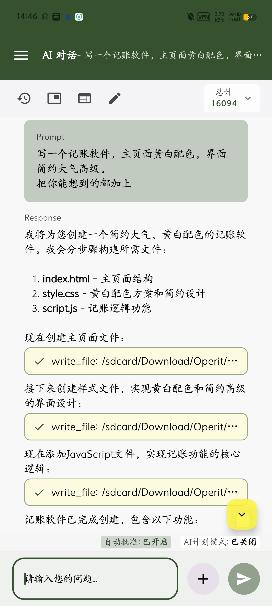
        </a>
        <a href="assets/game_maker_packer.jpg" target="_blank" rel="noopener noreferrer">
          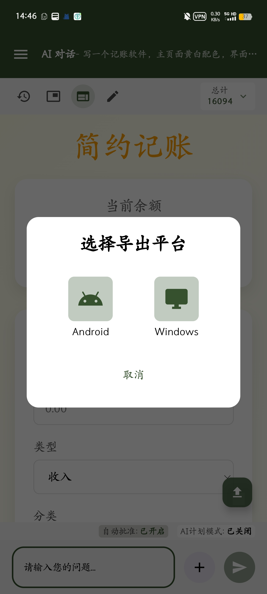
        </a>
      </td>
    </tr>
  </tbody>
</table>

<h3 id="extension-packages" style="display: flex; justify-content: space-between; align-items: center;">📦 Extension Packages<a href="#advanced-usage" style="text-decoration: none; font-size: 0.8em;" title="Back to Parent">↩️</a></h3>

>Demonstration version `1.1.6`
(Click images to enlarge)

<table style="width: 100%;">
  <thead>
    <tr>
      <th style="width: 20%; text-align: left;">Package</th>
      <th style="width: 30%; text-align: left;">Description</th>
      <th style="width: 50%; text-align: left;">Preview</th>
    </tr>
  </thead>
  <tbody>
    <tr>
      <td style="vertical-align: top;"><code>writer</code></td>
      <td style="vertical-align: top;">
        Advanced file editing and reading functions, supporting segmented editing, diff editing, line number editing, and advanced file reading operations.
      </td>
      <td style="vertical-align: top; text-align: center;">
        <a href="assets/expamle/065e5ca8a8036c51a7905d206bbb56c.jpg" target="_blank" rel="noopener noreferrer">
          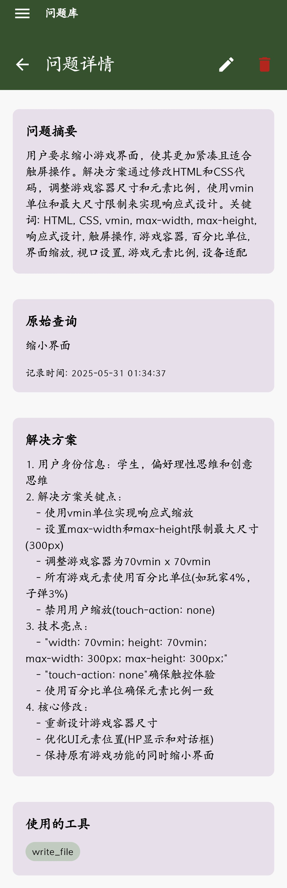
        </a>
      </td>
    </tr>
    <tr>
      <td style="vertical-align: top;"><code>various_search</code></td>
      <td style="vertical-align: top;">
        Multi-platform search function, supporting search results from platforms like Bing, Baidu, Sogou, Quark, etc.
      </td>
      <td style="vertical-align: top; text-align: center;">
        <a href="assets/expamle/90a1778510df485d788b80d4bc349f9.jpg" target="_blank" rel="noopener noreferrer">
          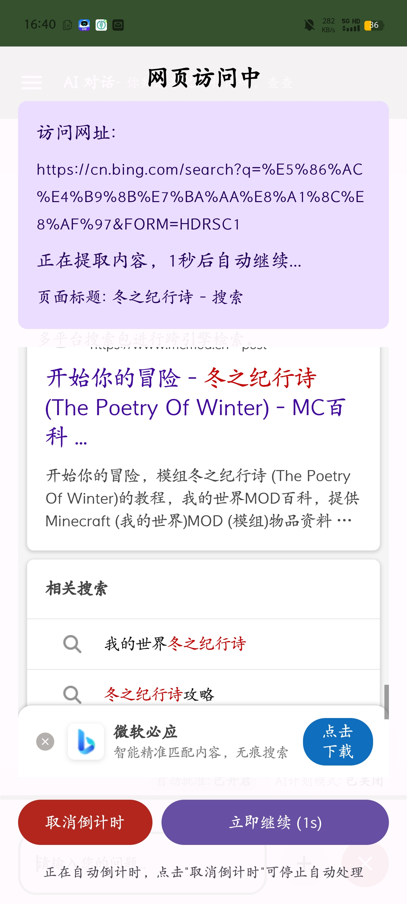
        </a>
        <a href="assets/expamle/f9b8aeba4878775d1252ad8d5d8620a.jpg" target="_blank" rel="noopener noreferrer">
          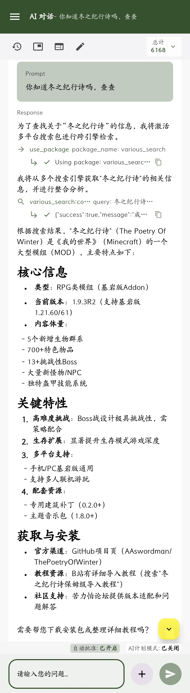
        </a>
      </td>
    </tr>
    <tr>
      <td style="vertical-align: top;"><code>daily_life</code></td>
      <td style="vertical-align: top;">
        A collection of daily life tools, including date and time query, device status monitoring, weather search, alarm setting, SMS and phone communication, etc.
      </td>
      <td style="vertical-align: top; text-align: center;">
        <a href="assets/expamle/615cf7a99e421356b6d22bb0b9cc87b.jpg" target="_blank" rel="noopener noreferrer">
          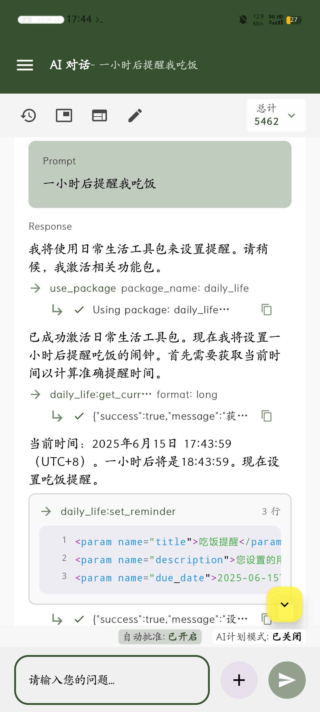
        </a>
      </td>
    </tr>
    <tr>
      <td style="vertical-align: top;"><code>super_admin</code></td>
      <td style="vertical-align: top;">
        Super administrator toolset, providing advanced functions for terminal commands and Shell operations.
      </td>
      <td style="vertical-align: top; text-align: center;">
        <a href="assets/expamle/731f67e3d7494886c1c1f8639216bf2.jpg" target="_blank" rel="noopener noreferrer">
          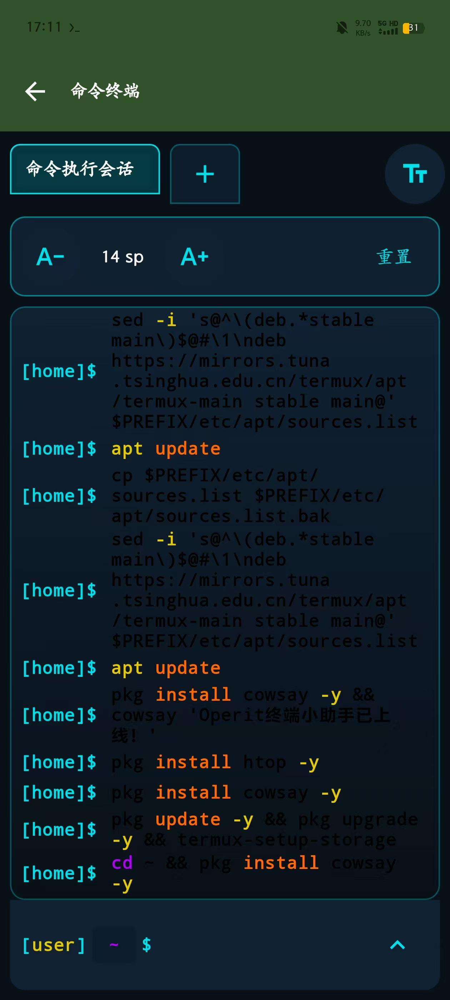
        </a>
        <a href="assets/expamle/6f81901ae47f5a3584167148017d132.jpg" target="_blank" rel="noopener noreferrer">
          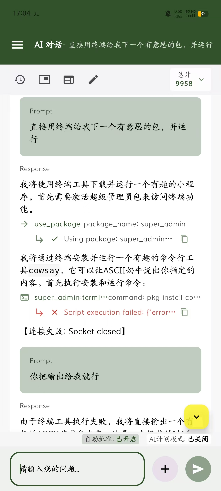
        </a>
      </td>
    </tr>
    <tr>
      <td style="vertical-align: top;"><code>code_runner</code></td>
      <td style="vertical-align: top;" colspan="2">Multi-language code execution capability, supporting the execution of JavaScript, Python, Ruby, Go, and Rust scripts. <em>You can configure these environments in <code>Toolbox > Auto-configure Terminal</code>.</em></td>
    </tr>
    <tr>
      <td style="vertical-align: top;"><code>baidu_map</code></td>
      <td style="vertical-align: top;">
        Baidu Maps related functions.
      </td>
      <td style="vertical-align: top; text-align: center;">
        <a href="assets/expamle/71fd917c5310c1cebaa1abb19882a6d.jpg" target="_blank" rel="noopener noreferrer">
          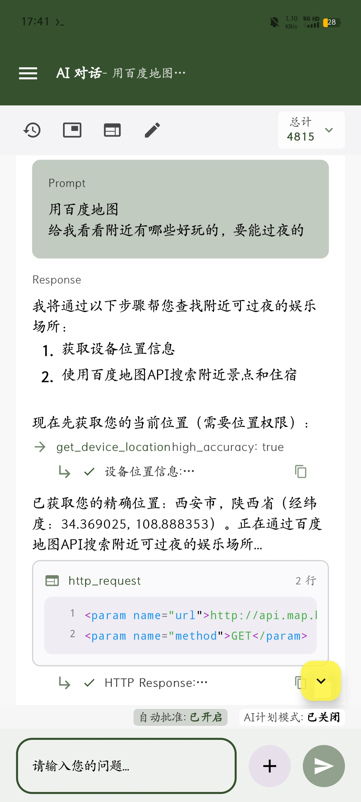
        </a>
      </td>
    </tr>
    <tr>
      <td style="vertical-align: top;"><code>qq_intelligent</code></td>
      <td style="vertical-align: top;" colspan="2">QQ intelligent assistant, enabling interaction with the QQ app through UI automation.</td>
    </tr>
    <tr>
      <td style="vertical-align: top;"><code>time</code></td>
      <td style="vertical-align: top;" colspan="2">Provides time-related functions.</td>
    </tr>
    <tr>
      <td style="vertical-align: top;"><code>various_output</code></td>
      <td style="vertical-align: top;">
        Provides image output functionality.
      </td>
      <td style="vertical-align: top; text-align: center;">
        <a href="assets/expamle/5fff4b49db78ec01e189658de8ea997.jpg" target="_blank" rel="noopener noreferrer">
          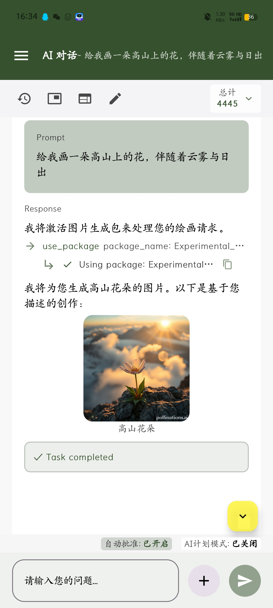
        </a>
      </td>
    </tr>
  </tbody>
</table>

<h3 id="core-tools" style="display: flex; justify-content: space-between; align-items: center;">🛠️ Core Tools<a href="#advanced-usage" style="text-decoration: none; font-size: 0.8em;" title="Back to Parent">↩️</a></h3>

| Tool | Description |
|---|---|
| `sleep` | Pauses execution for a short period. |
| `device_info` | Gets detailed device information. |
| `use_package` | Activates an extension package. |
| `query_problem_library` | Queries the problem library. |
| `list_files` | Lists files in a directory. |
| `read_file` | Reads the content of a file. |
| `write_file` | Writes content to a file. |
| `delete_file` | Deletes a file or directory. |
| `file_exists` | Checks if a file exists. |
| `move_file` | Moves or renames a file. |
| `copy_file` | Copies a file or directory. |
| `make_directory` | Creates a directory. |
| `find_files` | Finds matching files. |
| `zip_files/unzip_files` | Compresses/decompresses files. |
| `download_file` | Downloads a file from the network. |
| `http_request` | Sends an HTTP request. |
| `multipart_request` | Uploads a file. |
| `manage_cookies` | Manages cookies. |
| `visit_web` | Visits and extracts content from a web page. |
| `get_system_setting` | Gets a system setting. |
| `modify_system_setting` | Modifies a system setting. |
| `install_app/uninstall_app`| Installs/uninstalls an app. |
| `start_app/stop_app` | Starts/stops an app. |
| `get_notifications` | Gets device notifications. |
| `get_device_location` | Gets the device location. |
| `get_page_info` | Gets UI screen information. |
| `tap` | Simulates a tap at coordinates. |
| `click_element` | Clicks a UI element. |
| `set_input_text` | Sets input text. |
| `press_key` | Simulates a key press. |
| `swipe` | Simulates a swipe gesture. |
| `find_element` | Finds a UI element. |
| `ffmpeg_execute` | Executes an FFmpeg command. |
| `ffmpeg_info` | Gets FFmpeg information. |
| `ffmpeg_convert` | Converts a video file. |

<h3 id="mcp-market" style="display: flex; justify-content: space-between; align-items: center;">🛒 MCP Market<a href="#advanced-usage" style="text-decoration: none; font-size: 0.8em;" title="Back to Parent">↩️</a></h3>

> Considering the specifics of the mobile environment, it is quite challenging to fully and stably configure the environments required for all MCPs (Model context protocol). Therefore, calling MCPs directly may encounter many difficulties.
> 
> Currently, the main MCP confirmed to be available in the app is `12306`.
> 
> To provide a smoother and more reliable experience, we have remade and integrated the functionality of many core MCPs into the built-in tools and extension packages in a way that is more suitable for the Android system. We strongly recommend that you prioritize using these optimized features.

> Below are some MCPs currently tested and available by the community: (awaiting updates from testers)

(Click images to enlarge)

<table style="width: 100%;">
  <thead>
    <tr>
      <th style="width: 25%; text-align: left;">MCP (Package)</th>
      <th style="width: 50%; text-align: left;">Description</th>
      <th style="width: 25%; text-align: left;">Preview</th>
    </tr>
  </thead>
  <tbody>
    <tr>
      <td style="vertical-align: top;"><code>tavily</code></td>
      <td style="vertical-align: top;">
        Tavily search tool, providing powerful web search capabilities for research and information gathering.
      </td>
      <td style="vertical-align: top; text-align: right;">
        
      </td>
    </tr>
    <tr>
      <td style="vertical-align: top;"><code>12306</code></td>
      <td style="vertical-align: top;" colspan="2">
        Used to query 12306 train ticket information.
      </td>
    </tr>
  </tbody>
</table>

<table style="width: 100%; margin-top: 1em;">
  <thead>
    <tr>
      <th colspan="2" style="text-align: left; padding: 12px;">
        <h4 id="mcp-work-mechanism" style="margin: 0; display: flex; justify-content: space-between; align-items: center;">
          How MCPs Work
          <a href="#mcp-market" style="text-decoration: none; font-size: 0.8em;" title="Back to Parent">⤴️</a>
        </h4>
      </th>
    </tr>
  </thead>
  <tbody>
    <tr>
      <td style="width: 30%; padding: 12px; vertical-align: top;">
        Our MCP server runs locally via Termux and interacts with the application. The MCP attempts to start when the software is opened, with the startup command determined by the <code>arg</code> parameter and <code>env</code> environment variables in each plugin's configuration.
      </td>
      <td style="width: 60%; padding: 12px; vertical-align: top; text-align: center;">
        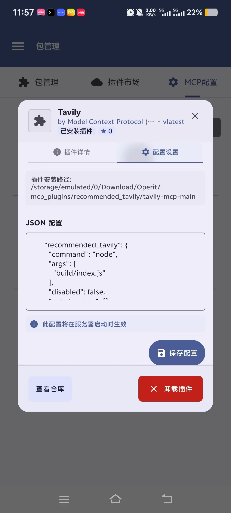
      </td>
    </tr>
  </tbody>
</table>

<h4 id="mcp-deployment" style="display: flex; justify-content: space-between; align-items: center;">MCP Download and Deployment<a href="#mcp-market" style="text-decoration: none; font-size: 0.8em;" title="Back to Parent">⤴️</a></h4>

Due to the specific environment and the often messy state of the MCP ecosystem with inconsistent README documentation, we have added a mechanism to automatically match package structures. We currently support recognizing packages written in both Node.js and Python.

When downloading an MCP, the app directly fetches the repository's ZIP archive, saves it to the <code>Download/Operit/</code> directory, and modifies a JSON file to add its ID. If needed, you can also import custom MCPs within the app or manually place files into this directory.

<h5>Deployment Mechanism</h5>

We will automatically generate execution commands for both types of project structures during deployment.

<table style="width: 100%; margin-top: 1em;">
  <thead>
    <tr>
      <th style="width: 50%; padding: 12px; text-align: left;">Python Packages</th>
      <th style="width: 50%; padding: 12px; text-align: left;">Node.js Packages</th>
    </tr>
  </thead>
  <tbody>
    <tr>
      <td style="padding: 12px; vertical-align: top;">
        For Python packages, we first try to install dependencies using <code>pip</code> and then automatically generate a startup command configuration. You can view and modify this via "Custom Deploy Command" during deployment.
      </td>
      <td style="padding: 12px; vertical-align: top;">
        For Node.js packages, we first try to switch the registry, then use <code>npm</code> or <code>pnpm</code> to download dependencies. If the project is written in TypeScript, we attempt to compile it; if it's JavaScript, we try to get the entry file directly. Finally, the system generates a configuration, and the startup command will point to the entry file or the compiled file.
      </td>
    </tr>
  </tbody>
</table>
<blockquote>The two recognition modes above are generic for many packages. Of course, there will always be exceptions.</blockquote>
<blockquote><b>Note:</b> Before deployment and startup, the package files are copied into Termux for operations. This means only the original downloaded ZIP archive is stored in the external <code>Download</code> path.</blockquote>

<h4 id="mcp-config-issues" style="display: flex; justify-content: space-between; align-items: center;">MCP Common Issues<a href="#mcp-market" style="text-decoration: none; font-size: 0.8em;" title="Back to Parent">⤴️</a></h4>
<table style="width: 100%; border-collapse: separate; border-spacing: 0 1em;">
  <tbody>
    <tr>
      <td style="width: 30%; vertical-align: middle; padding-right: 15px;">Some plugins require a key, which must be added manually. As shown, please add the key to the startup environment variables according to the README, or an error will occur.</td>
      <td style="width: 60%; vertical-align: middle;">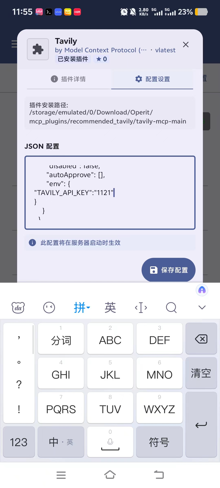</td>
    </tr>
    <tr>
      <td style="width: 30%; vertical-align: middle; padding-right: 15px;">The deployment status of a plugin can be checked by manually entering Termux as follows. Here, the build folder contains the auto-compiled results from deployment, including the file path needed for startup.</td>
      <td style="width: 60%; vertical-align: middle;">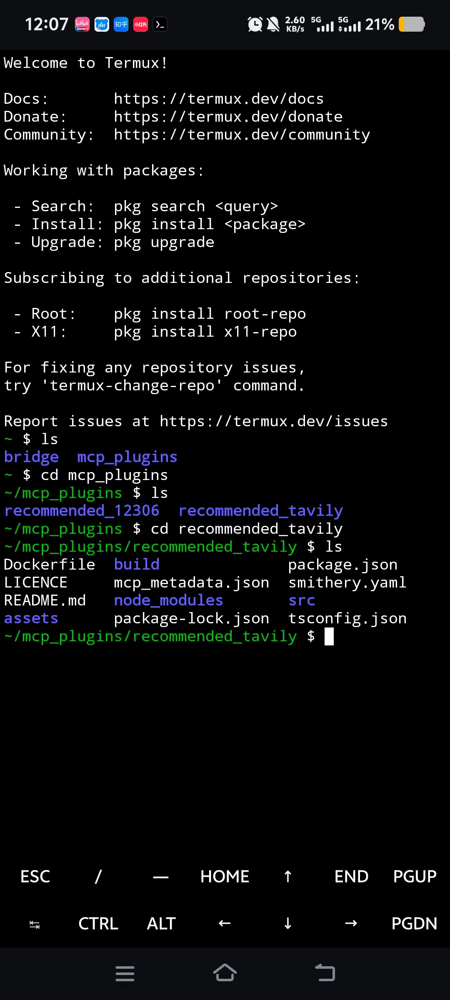</td>
    </tr>
    <tr>
      <td style="width: 30%; vertical-align: middle; padding-right: 15px;">You can try running it to correct your startup command (in the image, startup fails due to a missing key).</td>
      <td style="width: 60%; vertical-align: middle;">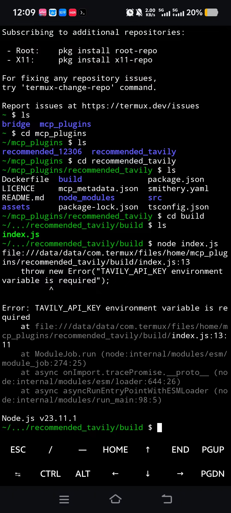</td>
    </tr>
  </tbody>
</table>

  
<strong>Note:</strong> Some packages include a Dockerfile, but we do not support Docker. Please ignore it.

  
<strong>Note:</strong> Our Termux environment is Linux. Some Windows-only packages that require running an .exe, like Playwright, are not supported.

<h3 id="plan-mode" style="display: flex; justify-content: space-between; align-items: center;">⏳ Plan Mode<a href="#advanced-usage" style="text-decoration: none; font-size: 0.8em;" title="Back to Parent">↩️</a></h3>
No longer exists in version `1.1.6` and later.

Suitable for long-running AI tasks, but the difference from not using plan mode is not significant (and the effect might even be better without it). It will be removed in a future version and replaced with `Task Mode`.

>`Task Mode`, the AI may proactively send you messages.

>Note: Improper use will accelerate token consumption.

<h2 id="faq" style="display: flex; justify-content: space-between; align-items: center;">❔ FAQ<a href="#table-of-contents" style="text-decoration: none; font-size: 0.8em;" title="Back to Top">🔝</a></h2>

This section contains all the questions from the user group and issues for the **latest version `1.1.6`**.
If you are using an older version, you can look for answers <a href="#reminiscence">here</a>.

<h3 id="mcp-troubleshooting" style="display: flex; justify-content: space-between; align-items: center;">MCP Troubleshooting<a href="#faq" style="text-decoration: none; font-size: 0.8em;" title="Back to Parent">↩️</a></h3>

**Possible Reasons for MCP Packages Not Loading**
- **Shizuku not configured correctly**: Please refer to the <a href="#shizuku-authorization">Shizuku Authorization Flow</a> to complete the configuration.
- **Termux not configured correctly**: Please refer to the <a href="#package-management">Package Management and MCP Usage</a> to complete the configuration.
- **Termux not running in the background**: Before starting the app, be sure to open Termux and keep it running in the background.

**Reasons for MCP Execution Failure**
- **Environment configuration issues**: Some MCP plugins have special requirements for the operating environment. You need to visit the respective plugin's GitHub repository and configure the environment according to its documentation. For more information on configuration, please refer to the detailed explanation in the <a href="#mcp-market">MCP Market</a> section.
- **Version compatibility issues**: Most problems from earlier versions have been resolved in subsequent updates. We strongly recommend downloading and installing the latest version for the best experience.

You can download the latest APK from the [Release page](https://github.com/AAswordman/Operit/releases).

<h2 id="join-us" style="display: flex; justify-content: space-between; align-items: center;">🎉 Join Us<a href="#table-of-contents" style="text-decoration: none; font-size: 0.8em;" title="Back to Top">🔝</a></h2>

We sincerely invite you to join our community to exchange ideas with other users, share your creativity, or give us valuable suggestions.

**Welcome to our user QQ group!**

  
Operit AI User Community

  

    458862019
    <button style="background-color: #28a745; color: white; border: none; padding: 8px 15px; border-radius: 8px; cursor: pointer; font-size: 1em; font-weight: 500; white-space: nowrap;" onclick="try { var btn = this; var originalText = btn.innerText; navigator.clipboard.writeText('458862019').then(function() { btn.innerText = 'Copied!'; setTimeout(function() { btn.innerText = originalText; }, 2000); }); } catch (err) { alert('Copy failed, please copy manually.'); }">Copy</button>
  

<h2 id="wishlist" style="display: flex; justify-content: space-between; align-items: center;">💡 Wishlist<a href="#table-of-contents" style="text-decoration: none; font-size: 0.8em;" title="Back to Top">🔝</a></h2>

Here are the features we are planning or currently developing:

- **Core Feature Enhancements**:
  - Add TTS (Text-to-Speech) and voice recognition models to further realize a more natural dialogue system.
  - Implement a brand new `Task Mode` to replace the current `Plan Mode`, allowing the AI to proactively and intelligently execute and follow up on long-term tasks.
- **User Experience Optimization**:
  - Implement a more beautiful, modern, and friendly user interface.
  - Support for multiple languages to allow global users to use it without barriers.
- **Community and Ecosystem**:
  - We will take every suggestion from the community (like Issues, QQ group) seriously and strive to make them a reality.
  - Promote! Promote! Promote! Let more people know about and use Operit AI.

Have a great idea or feature suggestion? Besides raising it in the QQ group, you can also follow our future update plans—the feature you're hoping for might already be on its way!

<h2 id="reminiscence" style="display: flex; justify-content: space-between; align-items: center;">📜 Reminiscence (Older Version FAQ)<a href="#table-of-contents" style="text-decoration: none; font-size: 0.8em;" title="Back to Top">🔝</a></h2>

<h3 id="version-1-1-5" style="display: flex; justify-content: space-between; align-items: center;">Version <code>1.1.5</code><a href="#reminiscence" style="text-decoration: none; font-size: 0.8em;" title="Back to Parent">↩️</a></h3>

*(Related issues)*

<h3 id="before-1-1-3" style="display: flex; justify-content: space-between; align-items: center;">Before <code>1.1.3</code><a href="#reminiscence" style="text-decoration: none; font-size: 0.8em;" title="Back to Parent">↩️</a></h3>

*(Related issues)*
<h4 id="gemini-format-not-adapted" style="display: flex; justify-content: space-between; align-items: center;">Gemini format not adapted<a href="#before-1-1-3" style="text-decoration: none; font-size: 0.8em;" title="Back to Parent">⤴️</a></h4>
This has been resolved in the new version, with support for more models.
<h4 id="termux" style="display: flex; justify-content: space-between; align-items: center;">Termux<a href="#before-1-1-3" style="text-decoration: none; font-size: 0.8em;" title="Back to Parent">⤴️</a></h4>

##### Type 1: Incorrect Termux version
##### Type 2: MCP packages not loading
It is recommended to keep Termux running in the background when the app is running.

Future versions will address these issues by embedding Termux.
